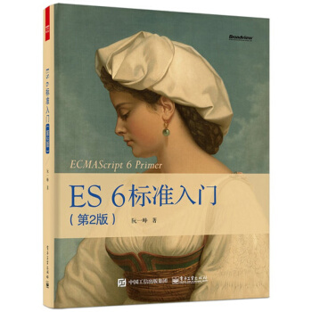

# 《ECMAScript 6 入门（第2版）》



> 已读完，2017年4月底。

## 第4章：字符串的扩展

> 今天读到阮一峰大侠写到`模板字符串`时，突然茅塞顿开。多读书真好！😢

- 字符的Unicode表示法
 JavaScript允许采用\uxxxx形式表示一个字符，其中“xxxx”表示字符的码点。但是，这种表示法只限于\u0000——\uFFFF之间的字符。ES6中只要将码点放入大括号，就能正确解读该字符。`'\u{1F680}' === '\uD83D\uDE80'`

- `codePointAt()`：返回32位十进制的UTF-16字符的码点。
- `String.fromCodePoint()`：码点转字符
- 字符串的遍历器接口：使用`for...of`遍历，用for循环遍历中文会出错。
- `at()`：返回字符给定位置的字符，可以用户Unicode编号大`0xFFFF`的字符。
- `normalize()`：将字符Unicode正规化。
- `includes()`, `startsWith()`, `endsWith()` ：include返回bool值，表示站到了参数字符串；startWith：返回布尔值，表示参数字符串是否在元字符串的头部；endsWith：返回布尔值，表示参数字符串是否在源字符串的尾部。（这个可以用在过滤条件中嘛）
- `repeat()`：返回一个字符串，表示将原字符串重复n此。
- `padStart()`，padEnd()：ES2017引入了字符补串全长度的功能，一个从头补，一个从尾开始补全。
- 模板字符串：使用反引号（`）标识N个段落，用`${}`在字符串中加入变量，用反斜杠(\)转义。更可以使用如下字符串模板：
例如将稍微长点的t-sql语句转换成JavaScript传统字符串如下：

```sql
select FID, FNumber, FName_L2, FCreator from T_IM_SaleIssueEntry where FBizDate between '2017-01-01' and '2017-03-01' and FBaseStatus = 4 --这里只是演示，生产环境300行起。
```

```JavaScript
var sqlCommand = 
  'select FID, FNumber, FName_L2, FCreator ' + 
  'from T_IM_SaleIssueEntry ' + 
  'where FBizDate between \'2017-01-01\' and \'2017-03-01\' ' +
         'and FBaseStatus = ' + baseStatus +'
```

那么用ES6就可以这样写：
```JavaScript
var sqlCommand = `
  select FID, FNumber, FName_L2, FCreator 
  from T_IM_SaleIssueEntry 
  where FBizDate between \'2017-01-01\' and \'2017-03-01\' 
  and FBaseStatus = ${baseStatus}`
```

#### **模板编译：**
```javascript
var template = `
<ul>
  <% for(var i=0; i < data.supplies.length; i++) { %>
    <li><%= data.supplies[i] %></li>
  <% } %>
</ul>
`;

// 模板编译函数：
function compile(template){
  var evalExpr = /<%=(.+?)%>/g;
  var expr = /<%([\s\S]+?)%>/g;

  template = template
    .replace(evalExpr, '`); \n  echo( $1 ); \n  echo(`')
    .replace(expr, '`); \n $1 \n  echo(`');

  template = 'echo(`' + template + '`);';

  var script =
  `(function parse(data){
    var output = "";

    function echo(html){
      output += html;
    }

    ${ template }

    return output;
  })`;

  return script;
}
```

compile函数的用法如下：
```javascript
var parse = eval(compile(template));
div.innerHTML = parse({ supplies: [ "broom", "mop", "cleaner" ] });
//   <ul>
//     <li>broom</li>
//     <li>mop</li>
//     <li>cleaner</li>
//   </ul>
```

- 标签模板
 它可以紧跟在一个函数名后面，该函数将被调用来处理这个模板字符串。这被称为“标签模板”功能（tagged template）。也就是说用\`\`将参数传入函数。
- String.raw()：往往用来充当模板字符串的处理函数，返回一个斜杠都被转义（即斜杠前面再加一个斜杠）的字符串，对应于替换变量后的模板字符串。

> 至此，我的EAS项目又提升了一步！😄

----------

## 第8章：函数的扩展

- 函数参数的默认值
 ES6 允许为函数的参数设置默认值，即直接写在参数定义的后面。
```javascript
function log(x, y = 'World') {
  console.log(x, y);
}


function Point(x = 0, y = 0) {
  this.x = x;
  this.y = y;
}
var p = new Point();
p // { x: 0, y: 0 }
```
只有传入undefined才会触发默认值，null则不会。
函数的length属性将返回没有指定默认值的参数个数。
作用域，一旦设置了参数的默认值，函数进行声明初始化时，参数会形成一个单独的作用域，等到初始化结束，这个作用域就会消失。
应用，李勇参数默认值，可以指定某一个参数不得省略，如果省略就抛出一个异常。当然也可以将参数默认值设置为undefined，表明这个参数是可以省略的。

- rest参数
ES6 引入 rest 参数（形式为“...变量名”），用于获取函数的多余参数，这样就不需要使用arguments对象了。rest 参数搭配的变量是一个数组，该变量将多余的参数放入数组中。

- 扩展运算符：扩展运算符（spread）是三个点（...）。它好比 rest 参数的逆运算，将一个数组转为用逗号分隔的参数序列。其可用于替代数组的apply方法。
扩展运算符的应用：1.合并数组；2.与解构赋值结合；3.函数的返回值；4.字符串；5.实现了Iterator接口的对象；6.Map和Set结构，Generator函数；

- 严格模式
- name属性：函数的name属性，返回该函数的函数名。如果将一个具名函数赋值给一个变量，则 ES5 和 ES6 的name属性都返回这个具名函数原本的名字。
- 箭头函数
基本用法：ES6允许使用“箭头”（=>）定义函数，读作‘gose on’。

- 绑定this
函数绑定运算符是并排的两个双冒号（::），双冒号左边是一个对象，右边是一个函数。该运算符会自动将左边的对象，作为上下文环境（即this对象），绑定到右边的函数上面。

- ★尾调用优化
尾调用（Tail Call）是函数式编程的一个重要概念，本身非常简单，一句话就能说清楚，就是指某个函数的最后一步是调用另一个函数。

尾递归之所以需要优化，原因是调用栈太多，造成溢出，那么只要减少调用栈，就不会溢出。怎么做可以减少调用栈呢？就是采用“循环”换掉“递归”。

类似Array.prototype.reduce函数！

----------

## 第9章：对象的扩展

- 属性的简洁表示法：ES6允许对象中，直接写变量，即属性名为变量名，属性值为变量值。方法也可以简写，但关键字不能出现，会报错。
- 属性名表达式：在对象的属性访问器中括号（[]）可以写表达式。
- 方法的name属性：返回函数名。特殊情况：bind方法创造的函数，name属性返回`bound`加上原函数的名字；`Funtcion`构造函数创造的函数，name属性返回anonymous。
- Object.is()：同值相等比较。`Object.is(+0, -0)` 和 `Object.is(NaN, NaN)`
- Object.assign()：用于对象的合并，将源对象（source）的所有可枚举属性，复制到目标对象（target）。其实行浅拷贝，不考虑继承的属性。常见用途：(1)为对象添加属性；(2)为对象添加方法；(3)克隆对象；(4)合并多个对象；(5)为属性指定默认值。以上都需要考虑被覆盖情况。
- 属性的可枚举型：对象的每个属性都有一个描述对象（Descriptor），用来控制该属性的行为。`Object.getOwnPropertyDescriptor`方法可以获取该属性的描述对象`{value, writable, enumerable, configurable}`。ES6规定，所有Class的原型的方法都是不可枚举的。
- 属性的遍历：(1)`for...in`循环遍历对象自身的和继承的可枚举属性(不含Symbol属性)；(2)`Object,keys`返回一个数组，包括对象自身的(不含继承的)所有可枚举属性(不含Symbol属性)；(3)`Object.getOwnPropertyNames(obj)`返回一个数组，包含对象自身的所有属性（不含Symbol属性，但是包括不可枚举属性）。(4)`Object.getOwnPropertySymbols(obj)`返回一个数组，包含对象自身的所有Symbol属性。(5)`Reflect.ownKeys(obj)`返回一个数组，包含对象自身的所有属性，不管是属性名是Symbol或字符串，也不管是否可枚举。
- __proto__属性，Object.setPrototypeOf()，Object.getPrototypeOf()：__proto__属性，用来读取或设置当前对象的prototype对象。`Object.setPrototypeOf()`设置一个对象的prototype对象，返回参数对象本身。`Object.getPrototypeOf()`获取一个对象的prototype对象，返回参数对象本身。
- Object.keys()，Object.values()，Object.entries()：`Object.keys`返回一个数组，成员是参数对象自身的（不含继承的）所有可遍历（enumerable）属性的键名。
- 对象的扩展运算符：(1)解构赋值，对象的解构赋值用于从一个对象取值，相当于将所有可遍历的、但尚未被读取的属性，分配到指定的对象上面。所有的键和它们的值，都会拷贝到新对象上面。；(2)扩展运算符，取出参数对象的所有可遍历属性，拷贝到当前对象之中。
- Object.getOwnPropertyDescriptors()：返回指定对象所有自身属性（非继承属性）的描述对象。
- Null 传导运算符：上面代码有三个?.运算符，只要其中一个返回null或undefined，就不再往下运算，而是返回undefined。

----------

## 第11章：Set和Map数据结构

- 因Set不能加重复值的特性，可以用作数组去重。
- `Array.from`方法可以讲Set结构转换成数组。
- 在Set中，可以使用扩展运算符(...)和`for...of`循环，而且还可以使用`map`和`filter`方法。因此可以使用Set加filter实现并集、交集、差集。
- WeakSet结构与Set类似，也是不重复的值的集合。其存储的都是弱引用，且不能被遍历。
- WeakSet的一个用处，是储存DOM节点，而不用担心这些节点从文档移除时，会引发内存泄漏。
- Map原生提供三个遍历器生成函数和一个遍历方法。keys()、values()、entries()、forEach()。Map的遍历顺序就是插入顺序。
- 结合数组的map方法、filter方法，可以实现Map的遍历和过滤（Map本身没有map和filter方法）。
- Map还有一个forEach方法，与数组的forEach方法类似，也可以实现遍历。
- WeakMAp只有四个方法可用：get()、set()、has()、delete()。没有遍历也没有清除。

----------

## 第12章：Proxy

```javascript
var pipe = (function () {
  return function (value) {
    var funcStack = [];
    var oproxy = new Proxy({} , {
      get : function (pipeObject, fnName) {
        if (fnName === 'get') {
          return funcStack.reduce(function (val, fn) {
            return fn(val); //此处报错，fn不是一个函数！
          },value);
        }
        funcStack.push(window[fnName]);
        return oproxy;
      }
    });

    return oproxy;
  }
}());

var double = n => n * 2;
var pow    = n => n * n;
var reverseInt = n => n.toString().split("").reverse().join("") | 0;

pipe(3).double.pow.reverseInt.get; // 63
```

> 上面代码原理：现在当前作用域注册一个pipe函数，使其可以链式编程。首先给pipe()传入参数，当获取它的值时(即调用内置getter)，只要函数名不是`get`，就将所调用函数的值push到全局变量的函数栈中保存，而当调用函数名为`get`时，用recude累积其以前的所有值！

----------

## 第16章：Generator函数的语法

- 一旦Generator执行过程中抛出错误，且没有被内部捕获，就不会再执行下去了。如果此后还调用`next`方法，将返回一个`value`属性等于`undefined`、`done`属性等于`true`的对象，即JavaScript引擎认为这个Generator已经运行结束了。在执行`next`方法，返回的还是`{ value: undefined, done: true }`

----------

## 第19章：Class

- 与ES5一样，实例的属性除非显式定义在其本身（即定义在`this`对象上），否则都是定义在原型上（即定义`在class`上）。
- 在子类的构造函数中，只有调用`super`以后，才可以使用`this`关键字。因为子类的构造是通过父类实例加工，只有`super`方法才能返回父类实例。
- `Object.getPrototypeOf`方法可以用来从子类上获取父类。
- 由于绑定子类的this，所以如果通过super对某个属性赋值，这时super就是this，赋值的属性会变成子类实例的属性。
- 子类实例的__proto__属性的__proto__属性，指向父类实例的__proto__属性。也就是说，子类的原型的原型，是父类的原型。

 