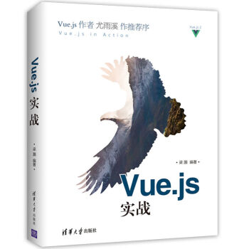

# 《Vue.js 实战》

> 用了iView，感觉很精髓，故买作者的书，以表敬意。其实看了iView的API对render很感兴趣啊~

[TOC]

## 第1章 初始Vue.js

## 第2章 数据绑定和第一个Vue应用

## 第3章 计算属性

## 第4章 v-bind 及 class 与 style 绑定

## 第5章 内置指令

## 第6章 表单与 v-model

## 第7章 组件详解

## 第8章 自定义指令

## 第9章 Render 函数
