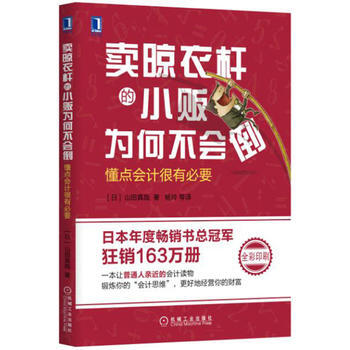

# 《卖晾衣杆的小贩为何不会倒》

## 第0章：会计学谚语

- 越穷越忙
- 富人不吵架
- 贪小便宜吃大亏
- 账合钱不合
- 巧妇难为无米之炊
- 打如意算盘
- 时间就是金钱
- 有钱能使鬼推磨
- 人穷志短
- 金银天下转吃亏是福高高兴兴收现金
- 库存是灾

## 第1章：盈利的方法

### 企业经营的大前提即在于长久经营

- 会计学术语称之为“持续经营”(going concern)
- 要持续，靠“利润”

### “利润”为企业经营的重中之重

- 有时，企业没有现金也能生存
- 利润不仅仅包含现金，同时也是在综合考虑了现金流动、赊购、票据以及工程设备投资等基础上计算出来的“会计上的盈利指标”
- ”收入“ 减去 ”费用“ 就是 ”利润“
- 增加利润无非两种方法：
  - 增加收入
  - 削减费用
- 相比 "增加收入"， "削减费用，即节省开支" 更为明智

### 怎么样通过节约 "创造利润"

- 从 "创造利润" 这一会计学目的来看，"吝啬鬼"的行为模式最为合理
- 节约不应以 "百分比" 计算，而应以 "绝对金额" 衡量
- 若不参考相关会计知识，将会发生 "节俭" 上有心无果
- 如果无法确保信息的完整与全面，那么也就不可能评价出真正的性价比
- 不被会计蒙蔽双眼的方法：
  - 大胆 "屏蔽" 宣传数据
  - 充分了解自家的开销

## 第2章：多样化经营

### 商业的原则是等价交换

- 等价交换 = 价值相同的物品(现金、商品和服务)之间进行相互交换

### 买卖需要多种业务结合起来考量("多样化经营")

- 无须完全依靠主营业务，如果辅助业务能盈利，生意就能持续
- 主营业务和辅助业务不能过分分散，将两者紧密结合是关键
- 多样化经营 = 经营和主营业务密切相关的辅助业务
- 企业永远在探索 "协同效益最高的业务" "能发挥公司优势技术的新型业务"
- "周末创业" 体现多样化经营理念
  - 个人的副业也需要导入多样化经营理念，并以此为原则

### 玩股票投资的方法

- 用 "多样化经营" 思想进行股票投资
  - 发挥自己的工作、兴趣、乐趣进行投资
- 优质企业必然以 "低风险、高收益" 为目标
- 个人投资也需要在投资前明确预算